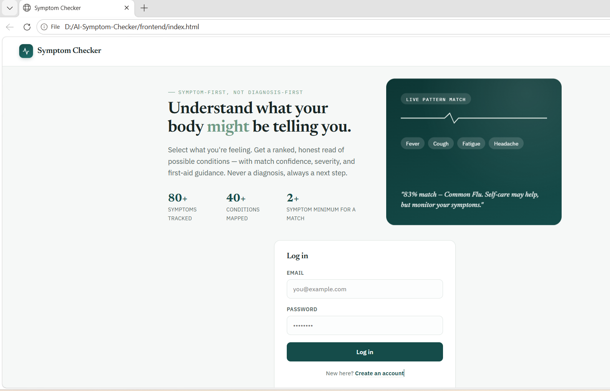
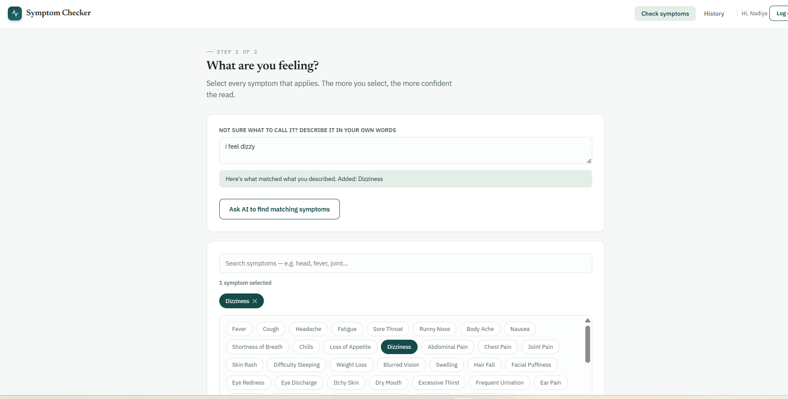
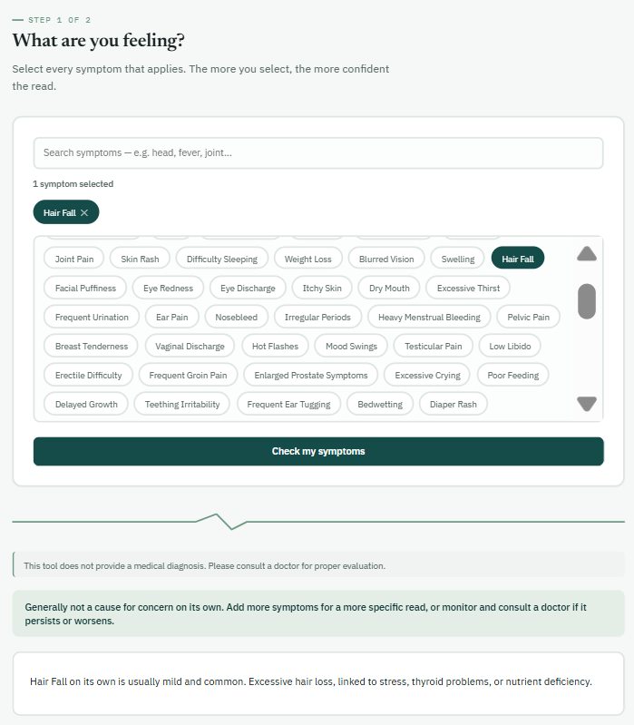
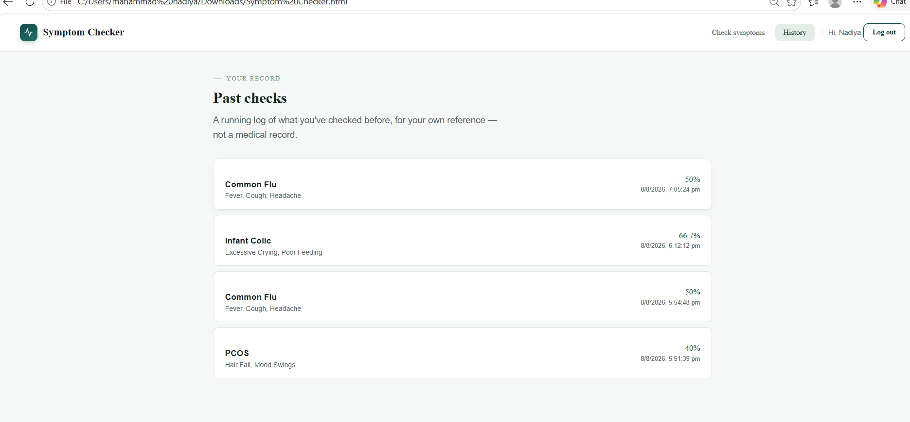

# AI Symptom Checker

A full-stack symptom-checking application that lets users select what they're feeling — or describe it in their own words to an AI assistant — and get a ranked, honest read of possible conditions, with match confidence, severity, and first-aid guidance. Built with a **safety-first prediction design**: it never guesses a serious diagnosis from a single vague symptom, and always points users toward professional medical advice rather than replacing it.

> ⚠️ This project is for educational purposes only. It does not provide medical diagnoses. Always consult a qualified doctor for real health concerns.

🔗 **Live site:** [mahammadnadiya.github.io/AI-Symptom-Checker](https://mahammadnadiya.github.io/AI-Symptom-Checker/)
🔗 **Backend API:** hosted on Render, connected to a live cloud MySQL database

---

## Why this project is different

Most beginner symptom-checker projects just match symptoms to diseases and show whatever comes back — which can be genuinely alarming (e.g. showing "COVID-19" to someone who only reported a mild fever). This project deliberately avoids that:

- **Minimum evidence threshold** — a disease is only shown if at least 2 symptoms match **and** it covers at least 30% of that disease's typical symptom set. One coincidental symptom is never enough to name a scary disease.
- **Single-symptom safety mode** — if a user selects just one symptom, the app doesn't run disease matching at all. Instead, it gives calm, informational context about that specific symptom, and automatically flags it as a **warning sign** instead of "usually mild" if the symptom's own data indicates urgency (e.g. "Severe Abdominal Pain (Pregnancy)," "Reduced Fetal Movement").
- **Match transparency** — every result shows exactly how many symptoms matched out of the disease's total (e.g. "5 of 6 symptoms matched — 83%"), so the confidence level is never hidden behind a bare disease name.
- **Severity-aware guidance** — the top match's severity (Mild / Moderate / Severe) drives a clear, appropriate call to action, from "self-care may help" to "please consult a doctor promptly."

---

## Features

- 🔐 **Authentication** — registration and login with BCrypt-encrypted passwords, passwords never exposed in any API response
- 🩺 **100+ symptoms** spanning general illness, digestive, respiratory, cardiovascular, mental health, and dedicated categories for women, men, children, elderly, and pregnancy/postpartum
- 🧬 **56+ diseases** linked to symptoms via a many-to-many relationship
- 🔍 **Symptom search** with partial, case-insensitive matching
- 🤖 **AI symptom assistant** — users who can't find the right word for how they feel can describe it in plain language (e.g. *"I feel dizzy and can't focus"*); a Gemini-powered assistant reads the description and auto-selects the matching symptoms from the known list
- 🧠 **Rule-based prediction engine** with match-percentage scoring and severity-based risk advice
- 📋 **Medical history** — every prediction a logged-in user runs is saved and viewable later
- 💻 **Custom frontend** — single-page HTML/JS app with an animated, distinctive UI (no frameworks required)
- ☁️ **Fully deployed** — backend on Render with a live cloud MySQL database (Aiven), frontend on GitHub Pages

---

## Tech stack

| Layer | Technology |
|---|---|
| Backend | Java 21, Spring Boot, Spring Data JPA, Spring Security |
| Database | MySQL (Aiven cloud) |
| Frontend | HTML, CSS, vanilla JavaScript (fetch API) |
| AI | Google Gemini API (free tier) |
| Auth | BCrypt password hashing |
| Hosting | Render (backend, Docker), GitHub Pages (frontend) |
| Tools | IntelliJ IDEA, Postman, MySQL Workbench, Git |

---

## API overview

| Feature | Method | Endpoint |
|---|---|---|
| Register | POST | `/users` |
| Login | POST | `/users/login` |
| Get all users | GET | `/users` |
| Get / delete user | GET / DELETE | `/users/{id}` |
| List symptoms | GET | `/symptoms` |
| Search symptoms | GET | `/symptoms/search?keyword=` |
| Create symptom | POST | `/symptoms` |
| List diseases | GET | `/diseases` |
| Create disease | POST | `/diseases` |
| **Predict** | POST | `/diseases/predict` |
| **AI symptom match** | POST | `/ai/match-symptoms` |
| Get user history | GET | `/history/{userId}` |

---

## Project structure

```
AI-Symptom-Checker/
├── backend/
│   └── backend/            # Spring Boot application
│       ├── Dockerfile      # For Render deployment
│       └── src/main/java/com/nadiya/backend/
│           ├── controller/ # REST endpoints (Users, Symptoms, Diseases, AI, History)
│           ├── service/    # Business logic
│           ├── repository/ # Data access (Spring Data JPA)
│           ├── entity/     # Database models
│           ├── dto/        # Response wrappers
│           └── config/     # Spring Security config
├── docs/
│   └── index.html          # Single-file frontend (served via GitHub Pages)
├── screenshots/
└── README.md
```

---

## Setup instructions (run it locally)

### Prerequisites
- Java 21+
- MySQL Server
- IntelliJ IDEA (or any Java IDE)
- A free Gemini API key from [Google AI Studio](https://aistudio.google.com) (only needed for the AI assistant feature)

### 1. Clone the repository
```bash
git clone https://github.com/MahammadNadiya/AI-Symptom-Checker.git
cd AI-Symptom-Checker
```

### 2. Set up the database
```sql
CREATE DATABASE symptom_checker;
```

### 3. Configure the backend
Inside `backend/backend/src/main/resources/`, create `application.properties` (gitignored) with:
```properties
spring.datasource.url=jdbc:mysql://localhost:3306/symptom_checker
spring.datasource.username=root
spring.datasource.password=YOUR_MYSQL_PASSWORD
spring.jpa.hibernate.ddl-auto=update
spring.jpa.show-sql=true

GEMINI_API_KEY=YOUR_GEMINI_API_KEY
```

### 4. Run the backend
```bash
cd backend/backend
./mvnw spring-boot:run
```
The API starts on `http://localhost:8080`.

### 5. Open the frontend
Open `docs/index.html` in your browser. To point it at your local backend instead of the deployed one, change the `API` constant near the top of the `<script>` section to `http://localhost:8080`.

---

## Screenshots






---

## Future improvements

- Migrate authentication to JWT-based sessions
- Add an admin panel for managing symptoms/diseases without Postman
- Optional ML-based prediction (decision tree) as an alternative to the rule-based engine
- Nearby hospital lookup via a maps API
- PDF report export of prediction results

---

## Disclaimer

This tool is a student/portfolio project and is **not a substitute for professional medical advice, diagnosis, or treatment**. Always consult a physician with any questions about a medical condition.
